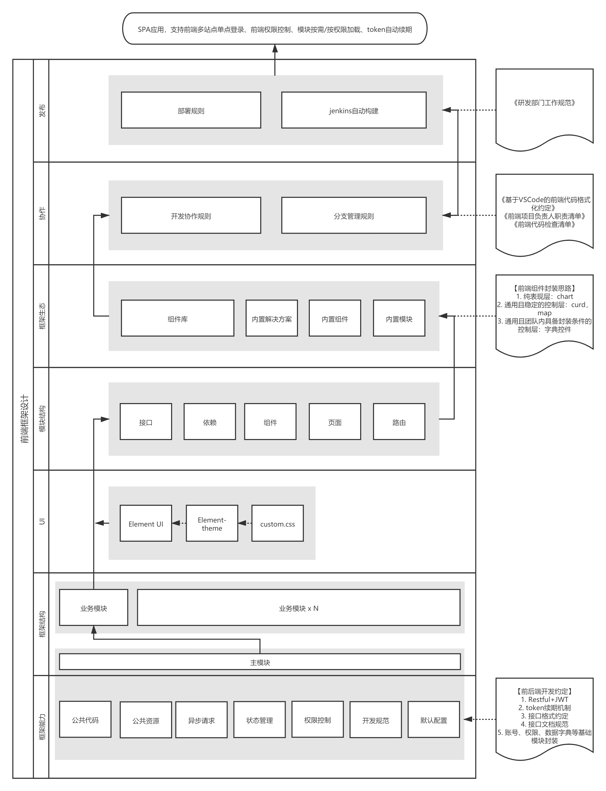

# CuttingMat

## 定位

CuttingMat（切割垫板）是基于Vue2.x的前端开发框架，与通用UI库（例如Element）不同，框架提供更底层、更全面的全链路前端开发服务。

CuttingMat的设计目标是用相对低的成本，提供相对高前端项目质量底线，解决初创前端团队普遍存在的开发质量参差不齐、代码架构杂乱无章等问题。

## 框架设计

在相当多面向定制的前端团队中，直接基于Element开始一个前端项目仍然是惯常做法，前期的基础功能规划和代码组织设计往往比较薄弱。

前期工作如果没有质量保证，随着项目的深入开发以及开发者人数的增加，到了开发中期会出现很多普遍性问题。比如代码组织混乱、资源引用混乱、协作者二次造轮子、项目整体代码冗余、性能低下等等。这些问题都会二次加速前端项目的腐烂，后期会越来越难以扩展和维护。

应对这种情况，需要在UI层之下做好底层工具支持和代码组织设计；在UI层之上做好常用业务封装，依托底层、UI、封装三层叠加，加速上层业务开发效率。

因此，CuttingMat将前端项目自底向上分为四层：核心层、UI层、封装层、业务层。

### 核心层

主要输出两种能力：工具能力和组织能力，对应前端框架的核心功能、目录结构、代码结构。

具体落实框架核心层时，除了做好前端核心能力的实现，还有很重要且容易被忽视的一大块内容是面向整个研发团队做全流程的支持和资源整合，比如代码管理、质量管理、发布流程等都可以跟前端框架做密切配合；面对后端团队可以做好前后端分离的相关约定、通用方案的框架级整合、基础功能模块的框架级配合等等，不能单独一方唱独角戏，要让前后端研发团队真正做到通力合作。

### UI层

理论上可以做到可插拔，但目前的Vue生态并没有太多优秀的三方UI，因此CuttingMat直接基于Element-UI开发。

对UI组件库的诉求始终是两点，组件够用和主题定制。在定制化项目中对组件库做样式自定义是大概率事件，所以前端框架应该对组件库的主题定制提供支持。除此之外基础组件够用就好，体积不宜过大。

### 封装层

这一层是对UI层的延申，是否需要这一层视业务情况而定，实践中通常体现为框架内置组件、内置模块、通用场景解决方案、内部组件库等。

CuttingMat重点面向定制项目，所以框架只内置少量业务无关的组件，更多与业务关系紧密的功能，均以组件库的形式做封装；

### 业务层

就是基于以上三层对业务逻辑的具体实现，以上三层是否有价值就体现在能否让业务层开发提效降本。

综上，框架整体的设计思路如下：

（右键在新标签中打开，查看高清大图）

::: tip 目录结构
前往[目录结构](./framework-structure)了解更多
:::

## 社区

- [Github Discussions](https://github.com/cutting-mat/template-element-ui/discussions)
- QQ群：361917044

## 许可

CuttingMat 使用 [MIT license](https://opensource.org/licenses/MIT) 许可证书。
