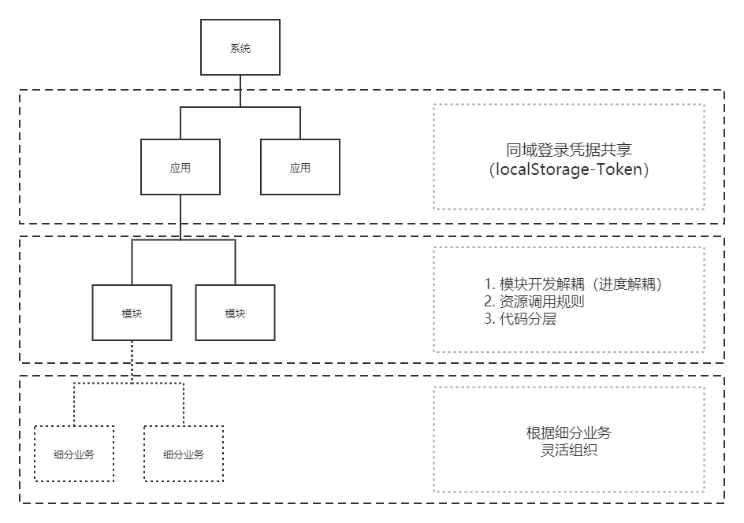
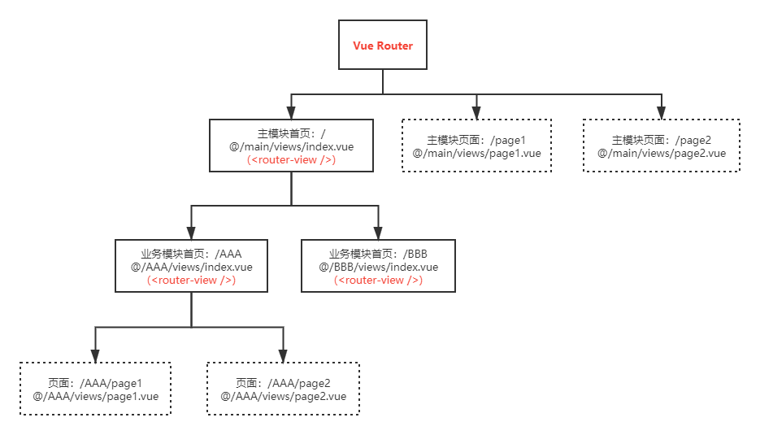

# 代码结构

代码结构是在目录结构的基础上，对代码组织规范做进一步约定。

## 代码组织关系

- **主模块与业务模块**从目录结构上看是平级的，但对于项目整体来说，主模块是项目入口，是所有业务模块的父节点，主模块就像一个托盘一样托起所有业务模块，这是主模块与其他模块的根本区别。

- **业务模块之间**是平级的，在开发过程中也应该是解耦的，模块间要尽可能减少资源依赖，即所谓“高内聚，低耦合”；确实有需要跨模块共享的代码，可以提炼为公共代码。

- **业务模块内部**可以根据实际情况继续拆分子模块，比如一个功能体量相对较大的模块，为了让开发关注点始终聚焦在一个相对小的范围内，可以根据功能细分再拆成多个小模块，大小模块间的路由关系如同主模块跟大模块的关系。

项目整体的代码组织关系如下图：

对应的路由关系如下图：

## 公共代码

公共代码管理的主要目的是减少项目内造轮子，提高协同开发效率。

- **项目级公共代码**应该尽可能提炼到主模块中，由主模块充当各个业务模块的公共资源池，比如通用接口（`@/main/api/common.js`）、公共组件（`@/main/components/`）、公共路由（登录注册页面）等。在项目开发过程中，开发组成员应维护一个`公共资源文档`，列明自己维护的公共代码及使用文档。

- **模块资源引用**，引用外部资源应该始终使用全路径，如（`@/${MoudleName}/assets/util.js`）；反之引用模块内部资源应该始终使用相对路径，如（`../assets/util.js`），以明确区分跨模块依赖关系。

## JS三层结构

- 通用功能：`@/core/index.js`是框架内置的功能实现，项目内可以随意调用。
- 模块脚本：`@/[Moudle Folder]/assets/util.js`是当前模块具备复用性的脚本，通常只在当前模块内使用。
- 组件方法：每个vue组件/页面的内部方法，仅作用于当前vue文件。

## CSS三层结构

- 全局样式：`@/core/global.css`是全局样式，被根组件引用，作用于项目全局。
- 模块样式：`@/[Moudle Folder]/assets/style.css`是模块级样式，被模块根组件引用，作用于当前模块。
- 组件样式：每个vue组件/页面的局部样式，仅作用于当前vue文件。

::: tip 框架能力
前往[【指南】](/guide/framework-core)近一步了解**CuttingMat**
:::
